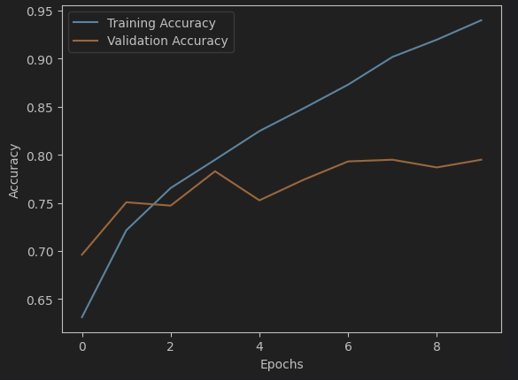

# Cat-Dog-Classification

This repository contains a [Jupyter](https://jupyter.org/) Notebook With the means to run a machine learning script to predict weather an image is of a dog or cat

**Data**
the data was received from [Kaggle Cats and Dogs Dataset](https://www.microsoft.com/en-us/download/details.aspx?id=54765) which gives a data set containing images of cats and dogs

The data is taken in using pandas

**Pre-Processing**

all images are loaded and re-sized to 64x64 pixels

they are then given labels of cat or dog

the data is then split into:
- Training: 60%
- Test: 20%
- Validation: 20%

**CNN**

the model is then initialized with various attributes:
- Specify the number of filters and their sizes
- Dropout randomly drops half the neurons form the dense call (prevents overfitting)
- Dense 1 is classification of cat or dog

The Data is then fit to the model and the accuracy is evaluated:

the model has an accuracy of ~94% and may be slightly overfit

the user may place their own image into the UserInput dir and tryout the model